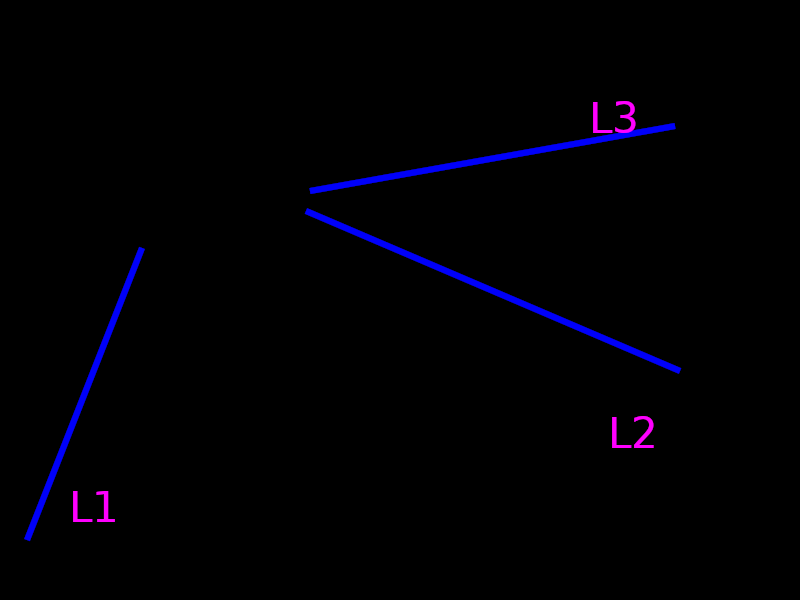
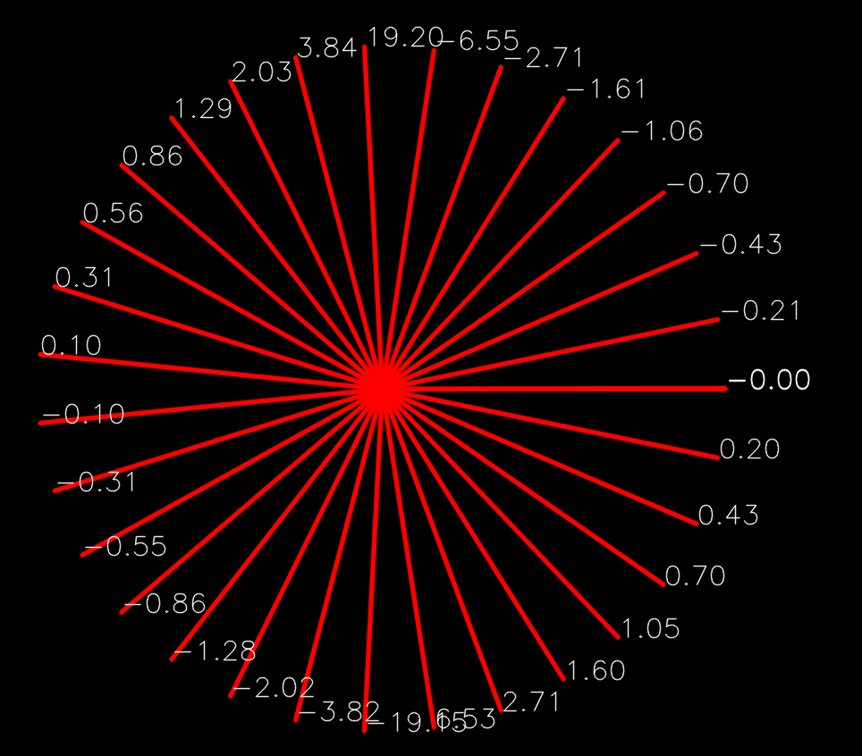
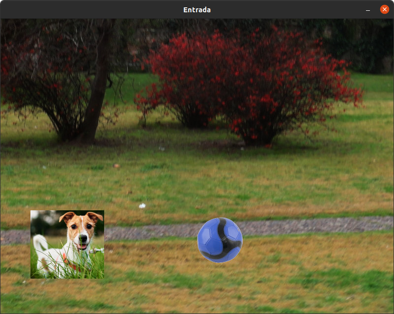
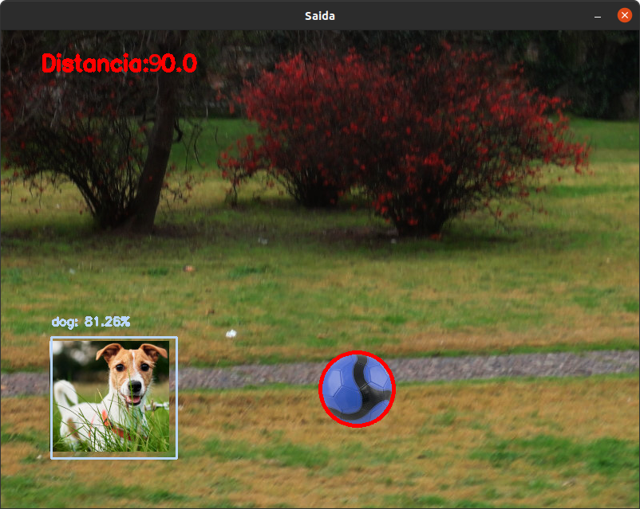

# Robótica Computacional 2022.1

[Mais orientações no README](./README.md)

## Primeiro simulado da prova

**Aqui você deverá escolher 2 questões dentre 3 para responder em um período de 2h.**

**Na prova real haverá 5 questões e você escolherá 4, em um período de 4h**

Esta prova é baseada em questões de provas e simulados anteriores, tantando manter o nível de dificuldade a ser encontrado na AI

Nome:_______________

Questões que fez:____________

Observações de avaliações nesta disciplina:

* Clone o repositório da prova dentro de `~/catkin_ws/src` se estiver trabalhando no Linux.
* Você poderá dar quantos `git push` quiser no repositório, apenas o último será considerado.
* Antes de finalizar a prova verifique que os arquivos enviados ao github estão na sua última versão. É sua responsabilidade garantir isso.
* Inicie a prova no Blackboard, que contém o link para a prova.
* Ponha o nome no enunciado da prova no Github
* Tenha os repositórios https://github.com/Insper/robot22.1/ ,  https://github.com/arnaldojr/my_simulation e https://github.com/arnaldojr/mybot_description.git  atualizados em seu `catkin_ws/src` .
* Você pode consultar a internet ou qualquer material, mas não pode se comunicar com pessoas ou colegas a respeito da prova
* Todos os códigos fornecidos estão executando perfeitamente. Foram testados no SSD da disciplina
* Teste sempre seu código
* Entregue código que executa - código com erro que impede de executar implica em zero na questào
* Faça commits e pushes frequentes no seu repositório (tem dicas [no final deste arquivo](./instrucoes_setup.md))
* Permite-se consultar qualquer material online ou próprio. Não se pode compartilhar informações com colegas durante a prova.
* Faça commits frequentes. Em caso de disputa sobre plágio, o primeiro a enviar alguma ideia será considerado autor original.
* A responsabilidade por ter o *setup* funcionando é de cada estudante.
* Questões de esclarecimento geral podem ser perguntadas diretamente aos professores.
* É proibido colaborar ou pedir ajuda a colegas ou qualquer pessoa que conheça os assuntos avaliados nesta prova.
* Os exercícios admitem diversas estratégias de resolução. A prova de cada aluno é única. Atenha-se apenas à rubrica de cada questão.

Existe algumas dicas de referência rápida de setup [instrucoes_setup.md](instrucoes_setup.md)

**Integridade Intelectual**

Se você tiver alguma evidência de fraude cometida nesta prova, [use este serviço de e-mail anônimo](https://www.guerrillamail.com/pt/compose)  para informar ao professor através do e-mail `antoniohps1@insper.edu.br`.

# Questões

## Questão 1 (2.5 pontos)

#### O que é para fazer

Um código que plota **na tela** sobre a imagem dois pontos de fuga entre as retas:
- Em verde, mostre o ponto de fuga entre L1 e L2.
- Em vermelho, mostre o ponto de fuga entre L2 e L3.

Para diferenciar as retas, use o coeficiente angular das mesmas. Dica:

#### Orientações

O código base para este exercício está em `q1/q1.py`. Trabalhe na função `pontos_fuga()`. Este exercício **não precisa** de ROS.

|Resultado| Conceito| 
|---|---|
| Não executa | 0 |
| Segmenta as retas mas não calcula interseção | 1.0 |
| Calcula interseção somente entre duas retas  | 1.8 |
| Calcula ambos os pontos de fuga              | 2.5 |

Casos intermediários ou omissos da rubrica serão decididos pelo professor.

## Questão 2  (2.50 pontos)

Você faz parte do projeto de uma plataforma digital para assistência a treinamento de cães, que tem o objetivo de fazer o pet se movimentar. Seu papel é fazer a parte da visão computacional que irá identificar se o cão está de fato fazendo o exercício pretendido e medir o seu aproveitamento.

Para tanto, seu programa deverá identificar se o cachorro se aproximou ou se afastou da bola entre dois frames consecutivos. No caso do cão se afastar da bola, uma mensagem adicional deve aperecer na imagem E no terminal: `REX, CORRE!`

#### Orientações

Trabalhe no arquivo `q2/q2.py`. Este exercício **não precisa** de ROS. Portanto pode ser feito até em Mac ou Windows

Você vai notar que este programa roda o vídeo `dogtraining.mp4`. Baixe o vídeo [neste endereço](https://drive.google.com/file/d/10v0lrUtciTE7HNeO2WSE4ug9HafpQvHP/view?usp=sharing), dentro da pasta `q2/`.

#### O que você deve fazer:

|Resultado| Conceito| 
|---|---|
| Não executa | zero |
| Identifica o cachorro OU a bola, marcando claramente na imagem | 1.0|
| Identifica o cachorro E a bola, marcando claramente na imagem  | 1.5|
| Identifica o cachorro e a bola e mede a distância entre os dois| 2.0 |
| Identifica que o cachorro se aproxima ou se afasta da boal     | 2.5 |

Casos intermediários ou omissos da rubrica serão decididos pelo professor.

*Exemplo do que deve ser feito*

Exemplo de imagem de entrada

Exemplo de imagem de saida

## Questões de ROS

**Atenção: ** 

Para fazer estra questão você precisa ter o `my_simulation` e o `mybot_description` atualizado.

    cd ~/catkin_ws/src
    cd my_simulation
    git stash
    git pull

Ou então se ainda não tiver:

    cd ~/catkin_ws/src
    git clone https://github.com/arnaldojr/my_simulation.git

Para o mybot_description:

    cd ~/catkin_ws/src
    cd mybot_description
    git stash
    git pull

Ou então se ainda não tiver:

    cd ~/catkin_ws/src
    git clone https://github.com/arnaldojr/mybot_description

Em seguida faça o [catkin_make](./instrucoes_setup.md). 

## Questão 3 (2.50 pontos)

No cenário representado abaixo, você deverá fazer o robô chegar próximo ($~30 cm$) de um creeper ciano, fazendo o robô voltar à posição inicial (0,0) usando a odometria.

#### O que é para fazer

Você deverá trabalhar no arquivo `sim1_221/scripts/q3.py`. Se quiser pode modificar os arquivos auxiliares, porém os mesmoms devem ser commitados junto com o arquivo da questão. 

#### Detalhes de como rodar

Para subir o cenário:

    roslaunch my_simulation reuniao.launch
    
Para rodar o programa, você pode:
1. Abrir o VSCode na pasta do arquivo e apertar o `play`
2. Executar o comando do ROS: `rosrun sim1_221 q3.py` caso tenha executado `catkin_make` corretamente

|Resultado| Conceito| 
|---|---|
| Não executa | 0 |
| Faz o robô detectar a cor azul | 1.0 |
| Chega próximo ao creeper   | 2.0 |
| Chega próximo ao creeper e volta | 2.5 |

Casos intermediários ou omissos da rubrica serão decididos pelo professor.

**Boa sorte!!**